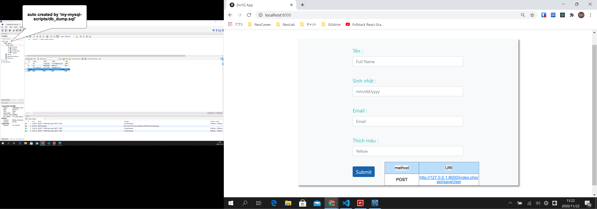

# react-ci3-api-cr-list 🚀

## deploy local
### FE
1. `cd php/react_app`
2. `react_app% npm i`
>3. (when reflect to BE by webpack after change in FE: delete folder `php/react_app/dist`)
4. `npm run prod`
- => will auto create folder `php/react_app/dist` 
### BE
5. `cd ../..`
6. `docker-compose up -d`
7. access browser: `localhost:8000`

